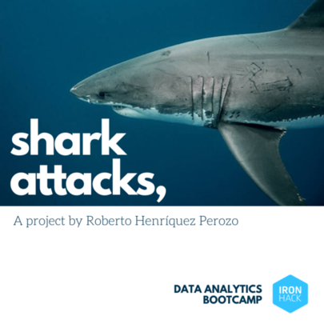

# Shark-attacks 
First project for IronHack Data Analytics Bootcamp

With the use of `Python 3`, and the modules `pandas`, `numpy` and `matplotlib`, I have tried to clean the shark-attacks dataset from Kaggle, and generated a cleaner and categorized dataset which can be found on the `/OUTPUT` directory, along with the graphs generated with `matplotlib`.

**Possible Hypothesis:**

- The 5 species with the most registered attacks have a similar *fatalities/survivals ratio*

- The activities with the most registered attacks have a very different *fatalities/survivals ratio*

- The 'Provoked attacks? have a higher *fatalities/survivals ratio* than the 'Unprovoked attacks'

- Fishers and Surfers have less 'Provoked attacks' than other victims.

This project is supposed to be `forked` and followed along. 

I invite you to make changes to it and submit a pull request with new ideas on how to dig deeper into the issue of Shark Attacks.

So go ahead, fork it, follow along, and experiment!